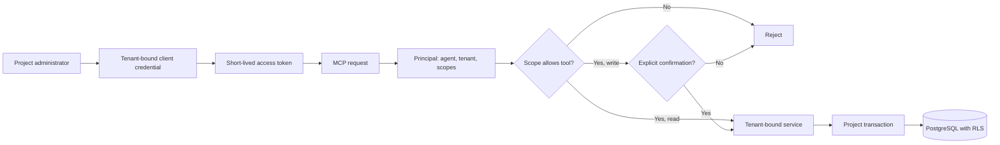

# Círculo — MCP Engineering Case Study

Círculo is a multi-tenant platform for independent learning communities. The product is under active development and its source repository remains private.

This repository documents one problem from that work:

> How can an AI agent operate a multi-tenant product without choosing its own tenant, permissions, or authority to change data?

This is a documentation-only case study. It does not contain the product source, production data, credentials, private endpoints, deployment details, or customer information.

## Why this needed more than a tool list

Exposing application functions through MCP is straightforward. The harder part is deciding what a tool call is allowed to mean.

A caller should not be able to change `projectId` in a payload and reach another tenant. A read credential should not become a write credential because the agent selected a different tool. A write should not happen simply because the model found a valid method name.

The current Círculo design treats identity as the starting point for every MCP request:

The tenant comes from the authenticated principal, not from caller-controlled arguments. Each tool declares a required scope. Every exposed write tool also requires `confirm: true` before its handler can run. Tenant-owned database operations execute inside a project-scoped transaction, with PostgreSQL row-level security as an additional boundary.

## The authority chain

| Question | Current answer |
| --- | --- |
| Which tenant can this agent reach? | The tenant bound to the access token. |
| Which tools can it call? | Only tools allowed by the token scopes. |
| Can a read call become a write? | No. Read and write scopes are separate. |
| Can a mutation run implicitly? | No. Write tools require an explicit confirmation field. |
| What if the tenant is inactive? | The request is rejected before tool execution. |
| What limits row access in PostgreSQL? | A transaction-local project context plus forced RLS on tenant-owned tables. |

The confirmation field is intentionally modest: it makes mutation intent explicit at the protocol boundary, but it does not prove who asked the agent to act. The surrounding agent workflow must still obtain real human authorization. Círculo does not treat `confirm: true` as a substitute for that workflow.

## What has been tested

The private implementation contains unit, integration, database and browser-level coverage for the MCP boundary. Among the verified scenarios:

- missing authentication, invalid bearer tokens and disallowed browser origins are rejected;
- insufficient scopes stop a call before the tool handler runs;
- write calls without explicit confirmation stop before the handler runs;
- a conflicting tenant value in tool arguments does not replace the tenant from the token;
- a PostgreSQL integration runner uses a non-owner role without `BYPASSRLS`, creates two tenants, exercises real MCP operations and checks cross-tenant isolation;
- tenant-bound upload tickets cannot be consumed by a token from another tenant;
- OAuth credentials can be created, rotated and revoked through the administrative flow;
- a revoked access token no longer authenticates MCP requests.

The main project CI runs the unit suite, database preparation, RLS verification, browser tests, production build, container build and dependency audit. The deeper PostgreSQL MCP flow and the MCP-specific browser journey are available as dedicated runners rather than being presented here as part of every CI execution.

See [Testing the boundary](docs/testing.md) for the evidence model and its limits.

## Read the case

- [Architecture](docs/architecture.md) — where browser and agent request paths meet.
- [MCP design](docs/mcp-design.md) — credentials, tokens, tools and request handling.
- [Authorization and tenancy](docs/authorization-and-tenancy.md) — how identity becomes authority.
- [Testing](docs/testing.md) — risks, test layers and what is not yet proven.
- [Engineering decisions](docs/engineering-decisions.md) — the main choices and their trade-offs.
- [Sanitized interaction](examples/mcp-interaction.md) — a reduced request/response walkthrough.

## Current status

This case reflects behavior implemented and tested in the current private development version reviewed on **September 1, 2026**.

It is not a claim of completed production readiness, formal verification, third-party security review, or compatibility with every MCP client. The public repository is deliberately narrower than the product: it explains the authorization model and the evidence behind it without publishing the application itself.

## Author

Built and documented by [Carlos Selva](https://github.com/selvalabs).
