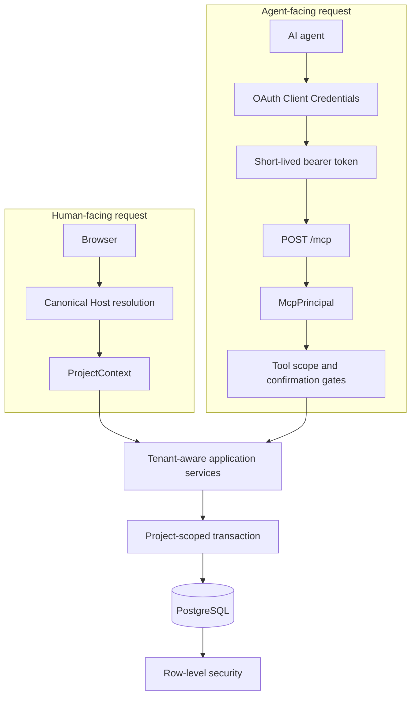

# Architecture

This document covers only the part of Círculo needed to understand its MCP boundary. The full product includes member, content, administration and integration workflows that are outside this case study.

## The relevant application path

Círculo is a TypeScript application with a React/Vite interface, a Fastify backend, Prisma-based persistence and PostgreSQL. Tenant-owned operations flow through application services that receive an explicit project context.

MCP adds a second entry point to the same product services. It does not create a parallel data model or a privileged agent-only backend.

The browser and agent paths resolve tenant authority differently, but they converge before persistence.

## Two request paths, one tenant boundary

### Browser requests

A browser request resolves one active project from the canonical `Host` value. The project is not selected from a query parameter, request body, cookie or forwarded-host value.

This matters because the hostname is part of the product boundary: a user visiting one tenant should not be able to switch context by adding an identifier to the request.

### MCP requests

An MCP request does not use the HTTP host to choose a tenant. The bearer token resolves to a principal containing:

- the agent identity;
- the project identity;
- the granted scopes;
- the token expiry.

Tool handlers receive the project from that principal. A caller-supplied `projectId` is not authoritative and cannot replace it.

This gives both paths the same downstream rule:

> Tenant-owned application services operate with a project context supplied by trusted request resolution, not by business input.

## Where authorization happens

The MCP path applies several checks before a tool reaches an application service:

1. an optional browser `Origin` must be allowed;
2. a bearer token must resolve to a valid principal;
3. the project must still be active;
4. the JSON-RPC method and tool name must be valid;
5. the principal must contain the tool's required scope;
6. a write tool must receive explicit confirmation.

Only after those checks does the handler create a project context and call the same tenant-aware stores used by the rest of the application.

The order is important. In particular, scope and confirmation failures occur before the tool handler is invoked.

## Database isolation

Application-level filtering is not the only tenant boundary.

Tenant-owned tables use PostgreSQL row-level security. A small transaction wrapper sets a transaction-local `app.current_project_id` value before executing tenant queries. RLS policies compare each row's project identifier with that value for both reads and writes.

The intended application database role is:

- not a table owner;
- not a superuser;
- not allowed to bypass RLS;
- limited to the DML privileges needed by the application.

Migrations and seed operations use a separate owner connection. This separation prevents ordinary application code from silently escaping the same policies it is meant to exercise.

### Resolving identity before a normal tenant query

Some lookups occur at the point where tenant identity is being discovered.

The browser path uses a narrow canonical-host registry before it can create a project context. The MCP path uses tenant-bound client and token identifiers differently: it validates the tenant portion first, establishes a project-scoped transaction, and only then looks up the hashed credential or access-token record.

The current migrations enable and force RLS on MCP credential, access-token and upload-ticket tables as well. The tenant-bound identifier makes that possible without storing or trusting the raw secret as project authority.

This is a deliberate part of the identity design, not an assumption that authentication tables should bypass tenant controls.

## Defense in depth

The architecture uses overlapping controls because each one answers a different question:

| Layer | Question it answers |
| --- | --- |
| Credential and token lifecycle | Is this still a valid agent identity? |
| Active-project guard | Is this tenant still allowed to operate? |
| Tool scope | May this identity call this class of operation? |
| Explicit confirmation | Is this call intentionally asking for a mutation? |
| Project-aware services | Which tenant context reaches the domain operation? |
| PostgreSQL RLS | Which tenant rows may the application role read or change? |
| Audit record | Which agent identity was associated with a completed mutation? |

No single layer is presented as a complete security model. The value comes from keeping tenant identity consistent as a request moves from transport to tool selection, domain logic and persistence.

## Runtime defaults

The remote MCP surface is disabled by default in the product configuration. Enabling it requires an explicit issuer, audience and origin policy, and the remote deployment is expected to terminate HTTPS before exposing the endpoint.

Those deployment details remain in the private product repository. This public case documents the application boundary, not the production network or secret-management setup.
