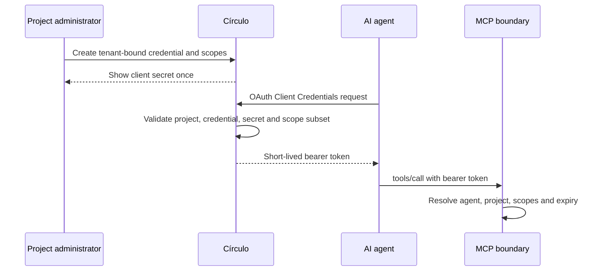

# Authorization and tenancy

The central rule in Círculo's MCP design is simple:

> Identity decides authority.

The tool payload describes the requested operation. It does not decide which tenant the caller belongs to or which permissions the caller has.

## From credential to principal

A project administrator creates an MCP credential inside one tenant. The credential records an agent identity and a set of allowed scopes.

The client secret is returned once. The application stores a hash rather than the original secret.

The agent then uses OAuth Client Credentials to request an access token. Token issuance checks that:

- the credential exists and belongs to an active project;
- the credential has not expired or been revoked;
- the supplied secret matches the stored hash;
- any requested scopes are a subset of the credential's scopes.

The current implementation issues an opaque bearer token with a 15-minute lifetime. The token is also stored by hash. Resolving it produces an MCP principal:

```text
agent identity
project identity
scopes
expiry
```

Credential rotation invalidates existing access tokens associated with that credential. Credential and token revocation are also checked when a token is resolved, so a previously issued token does not remain authoritative after revocation.



## Tenant binding

For MCP requests, the project comes from the access token. It is not accepted from:

- tool arguments;
- query parameters;
- the request body outside the authenticated principal;
- a hostname chosen to impersonate another tenant.

The server converts the authenticated principal into a project context before calling tenant-aware services.

This distinction is important. A tool may need identifiers such as a course slug, member ID or lesson slug, but those identifiers are interpreted inside the project context already selected by the token.

A transport-level test sends a conflicting `projectId` in a tool call and verifies that the operation still receives the project from the authenticated principal.

## Tool scopes

Each exposed tool declares one required scope. Examples include:

| Area | Read authority | Write authority |
| --- | --- | --- |
| Project context | `project:read` | — |
| Members and access | `members:read` | `members:write` |
| Catalog | `catalog:read` | `catalog:write` |
| Lesson publication | — | `catalog:publish` |
| Appearance | `appearance:read` | `appearance:write` |
| Settings | `settings:read` | `settings:write` |
| Assets | `assets:read` | `assets:write` |
| Materials | `materials:read` | `materials:write` |
| Commerce configuration | `commerce:read` | `commerce:write` |

The current scope-matrix test checks that every tool included in the tested configuration maps to an intentional scope. It also checks a useful invariant: read tools do not require mutation confirmation, while every write tool does.

Scope validation occurs before the tool handler runs. A model cannot reach a write handler with a read-only token and rely on downstream code to notice the problem later.

## Explicit confirmation for mutations

All current write tools are marked as requiring confirmation. A call without `confirm: true` is rejected before the handler executes.

This protects against a common class of accidental agent behavior: a model discovers a valid write tool and calls it while it is still exploring or planning.

The boundary is useful, but intentionally limited. The server can verify that a request explicitly asserts confirmation; it cannot determine whether a human genuinely approved that request in another conversation.

For that reason, the agent contract adds a separate behavioral rule: an agent must not retry a rejected write by adding `confirm: true` unless it has received a new, explicit authorization from the user or administrator.

In other words:

```text
server confirmation gate
    !=
proof of human intent
```

The server makes mutation intent explicit and auditable. The surrounding agent workflow remains responsible for obtaining real approval.

## Project-aware persistence

After transport and tool authorization, tenant-owned operations run inside a project-scoped transaction.

The transaction sets a local PostgreSQL setting for the current project. Forced RLS policies on tenant-owned tables compare row ownership against that value for both reads and writes.

This provides a second boundary if an application query is incomplete or a store is used incorrectly. The intended application role is a non-owner role without `BYPASSRLS`; a separate owner connection is reserved for migrations and controlled setup.

RLS is defense in depth, not a replacement for application authorization. The application still resolves identity, checks scopes and passes a project context to its stores before reaching the database.

## Project lifecycle

Tenant authority is not permanent merely because a token was once issued.

Before tool execution, the MCP path can reject a project that is no longer active. Token resolution also checks the current project and credential state. This means suspension, credential revocation, token revocation and expiry can all remove authority without changing the tool implementation.

## Failure behavior

The current boundary separates transport failures from MCP method failures:

| Situation | Result |
| --- | --- |
| Missing or invalid bearer token | HTTP `401` |
| Disallowed browser origin | HTTP `403` |
| Inactive project | HTTP `403` |
| Unknown tool | JSON-RPC error `-32602` |
| Insufficient tool scope | MCP error `-32004` |
| Missing mutation confirmation | MCP error `-32005` |
| Tool execution failure | Generic MCP error `-32000` |

Handlers are not invoked when scope or confirmation checks fail.

## Audit and accountability

Write-tool handlers pass the authenticated agent identity into the audit path together with the action, entity and a reduced metadata record.

The purpose is not to log prompts or secrets. It is to preserve a useful operational answer to a narrower question:

> Which authenticated agent identity was associated with this mutation?

Audit records help investigation and accountability after an action. They do not prevent an over-scoped or compromised credential from being used, so scope design, short token lifetime and revocation remain necessary.

## Remaining risks

This design reduces authority confusion, but it does not remove every agent risk.

- A credential granted too many scopes remains too powerful.
- A compromised client secret can be used until it is rotated, revoked or expires.
- `confirm: true` is a protocol assertion, not cryptographic proof of human approval.
- Tool descriptions and schemas still need careful maintenance as the product changes.
- RLS depends on using the intended non-owner application role.
- External agent behavior remains outside the server's complete control.

Those limits are why the case study describes layered controls rather than claiming autonomous operation is inherently safe.
